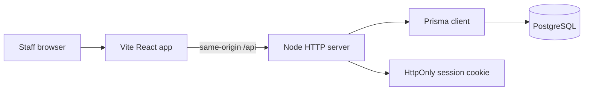

# System Architecture Map

## Primary Areas

- Frontend routes and navigation: `src/App.tsx`, `src/hooks/use-navigation.ts`
- Auth and permissions: `src/hooks/use-auth.tsx`, `server/security.mjs`, `server/rbac.mjs`
- PMS operations: `server/pms-service.mjs`, `server/pms-domain.mjs`
- Database schema and migrations: `prisma/schema.prisma`, `prisma/migrations`
- Release checks: `scripts/launch-check.mjs`, `scripts/run-e2e-tests.mjs`

For detailed architecture notes, see [TECHNICAL-ARCHITECTURE.md](./TECHNICAL-ARCHITECTURE.md) and [DATA-MODEL.md](./DATA-MODEL.md).
